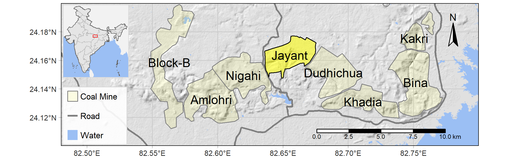

# Load the packages

```{r message=FALSE, warning=FALSE}
library(dplyr)
library(grid) # arranging inset maps
library(OpenStreetMap) # OSM Maps and data
library(osmdata) # osm data download
library(raster) # raster data and operations
library(sf) # simple features for spatial data
library(tmap) # thematic mapping
library(tmaptools) 
```

# Prepare a base hillshade

```{r hillshade}
bb <- c(82.48, 24.1, 82.8, 24.2) # extent for target site as left, bottom, right, upper

#dem <- getData(name = "SRTM", lon = 84, lat = 24, path = "./dem/") # download data from SRTM

#dem_crop <- dem %>% crop(extent(82.48, 82.8, 24.1, 24.2)) # cropped to target site
#rm(dem) # remove dem from environment

#slope <- terrain(dem_crop, opt= "slope") # extract slope from dem_crop
#aspect <- terrain(dem_crop, opt= "aspect") # extract aspect from dem_crop
#dem_hs <- hillShade(slope = slope, aspect = aspect, angle = 45, direction = 315) # prepare hill shade
# 45 altitude angle and 315 azimuth angle

#writeRaster(x = dem_hs, filename = "./data/dem_hs.tif", overwrite = T) # write to local directory
#rm(slope, aspect) # removed slope and aspect files

hs <- raster("./data/dem_hs.tif") # read the hillshade file

tm_shape(hs) + 
      tm_raster(palette = "-Greys", n = 100, style = "cont", alpha = 0.7,
                         legend.show = FALSE)
```


## add water element

```{r water}
# https://storage.googleapis.com/earthenginepartners-hansen/GFC-2019-v1.7/Hansen_GFC-2019-v1.7_datamask_30N_080E.tif

#water <- raster("./data/Hansen_GFC2014_datamask_30N_080E.tif") %>% 
      #crop(extent(82.48, 82.8, 24.1, 24.2)) %>% 
      #calc(fun = function(x){x[x == 1] <- NA; return(x)})
#writeRaster(x = water, filename = "./data/singrauli-water.tif", overwrite = T) # write to local directory

water <- raster("./data/singrauli-water.tif") # read the hillshade file

# colors for water #4a80f5, #9bbff4, #a7cdf2, #AADAFF

tm_shape(hs) + 
      tm_raster(palette = "-Greys", n = 100, style = "cont", alpha = 0.7,
                         legend.show = FALSE) + # hillshade
      
      tm_shape(water) + 
      tm_raster(palette = c("#9bbff4"), style = "cat", legend.show = FALSE)  # water

```

## add major roads

```{r singrauli-roads, message=FALSE, warning=FALSE}
#s_roads <- opq(bbox = bb) %>% # xmin, ymin, xmax, ymax
      #add_osm_feature(key = "highway", value = c("trunk")) %>% 
      #osmdata_sf()
#s_roads <- s_roads$osm_lines
#st_write(s_roads, "./data/singrauli-road/singrauli-road.shp")

s_roads <- st_read("./data/singrauli-road/singrauli-road.shp")
s_roads <- s_roads %>% st_set_crs(4326)

tm_shape(hs) + tm_raster(palette = "-Greys", n = 100, style = "cont", alpha = 0.7,
                         legend.show = FALSE) + # hillshade
      
      tm_shape(water) + tm_raster(palette = c("#9bbff4"), style = "cat",  
                            legend.show = FALSE) + # water
      
      tm_shape(s_roads) + tm_lines(col = "ref", palette = c("grey50", "grey40"),
                                   lwd = 2.5, legend.col.show = FALSE) # roads
```

## add coal mine boundaries

```{r}
#s_mines <- opq(bbox = bb) %>% # xmin, ymin, xmax, ymax
       #add_osm_feature(key = "landuse", value = "quarry") %>% 
       #osmdata_sf()
#s_mines <- s_mines$osm_polygons
#st_write(s_mines, "./data/singrauli-mines/singrauli-mines.shp")

# coal mines
cm <- st_read("./data/singrauli-mines/singrauli-mines.shp") 
cm$mine <- c("Khadia", "", "Bina", "Amlohri", "Dudhichua", "", 
             "Jhingurdah", "Kakri", "Nigahi", "Block-B")

# jayant mine
cmj <- cm %>% dplyr::filter(name == "Jayant Mine") 
cmj$mine <- "Jayant"

tm_shape(hs) + tm_raster(palette = "-Greys", n = 100, style = "cont", alpha = 0.7,
                         legend.show = FALSE) + # hillshade
      
      tm_shape(water) + tm_raster(palette = c("#9bbff4"), style = "cat",  
                            legend.show = FALSE) + # water
      
      tm_shape(s_roads) + tm_lines(col = "ref", palette = c("grey50", "grey40"),
                                   lwd = 2.5, legend.col.show = FALSE) + # roads
      tm_shape(cm) + 
      tm_fill(col = "yellow", alpha = 0.1) + 
      tm_borders(col = "grey50") +
      tm_text(text = "mine") + # coal mine shapes
      
      tm_shape(cmj) + tm_fill(col = "yellow", alpha = 0.5) + 
      tm_text(text = "mine") +
      tm_borders(col = "black")  # Jayant Mine shape
```

## prepare inset map

https://map.igismap.com/gis-data/india/administrative_state_boundary?utm_source=website&utm_medium=datadownload&utm_campaign=india

https://map.igismap.com/gis-data/india/administrative_assembly_constituencies_boundary?utm_source=website&utm_medium=datadownload&utm_campaign=india

```{r}
# https://www.naturalearthdata.com/download/50m/cultural/ne_50m_admin_0_countries.zip
world_adm <- st_read("D:/spatial-data/admin/ne_world_adm/ne_50m_admin_0_countries.shp")

# Indian states
ind_adm <- st_read("D:/spatial-data/admin/ind_adm1/ind_adm1.shp")

# https://map.igismap.com/gis-data/india/administrative_outline_boundary?utm_source=website&utm_medium=datadownload&utm_campaign=india

ind_adm0 <- st_read("D:/spatial-data/admin/ind_adm0/ind_adm0.shp")

#s_bb <- bb_poly(hs, projection = 4326) # bounding box 

s_bb <- st_bbox(obj = c(xmin = 81.5, xmax = 83.5, ymin = 23.5, ymax = 24.5),
                    crs = st_crs(hs)) %>% 
      st_as_sfc()

inset_map <- tm_shape(world_adm, bbox = st_bbox(ind_adm)) + 
      tm_fill(col = "grey95") +
      
      tm_shape(ind_adm) + tm_fill(col = "grey90") + tm_borders(col = "grey70", lwd = 0.5) +
      
      tm_shape(ind_adm0) + tm_borders(lwd = 0.75) +
      
      tm_shape(s_bb) + tm_borders(col = "red", lwd = 0.75) +
      
      tm_layout(bg.color = "#9bbff4", frame = "grey85")
inset_map

#rm(cm, cmj, hs, ind_adm, ind_adm0, s_bb, s_roads, water, world_adm) # remove undesired files
```
### aspect ratios for main map and inset map

```{r}
# aspect ratio for main map
xy <- st_bbox(hs)
asp <- (xy$ymax - xy$ymin)/(xy$xmax - xy$xmin) 

# aspect ratio inset map
xy <- st_bbox(ind_adm)
asp2 <- (xy$ymax - xy$ymin)/(xy$xmax - xy$xmin)
```


## final main map

```{r}
main_map <- tm_shape(hs) + 
      tm_raster(palette = "-Greys", n = 100, style = "cont", alpha = 0.7,
                legend.show = FALSE) + # hillshade
      
      tm_graticules(col = "grey80") + # graticules
      
      tm_shape(water) + 
      tm_raster(palette = c("#9bbff4"), style = "cat", legend.show = FALSE) + # water
      
      tm_shape(s_roads) + 
      tm_lines(col = "grey50", lwd = 2.5) + # roads
      
      tm_shape(cm) + 
      tm_fill(col = "yellow", alpha = 0.1) + 
      tm_borders(col = "grey50") +
      tm_text(text = "mine") + # coal mine shapes
      
      tm_shape(cmj) + tm_fill(col = "yellow", alpha = 0.5) + 
      tm_text(text = "mine") +
      tm_borders(col = "black") + # Jayant Mine shape
      
      tm_compass(position = c("right", "top")) + # North Arrow
      
      tm_scale_bar(position = c(0.6, 0.015), breaks = c(0, 2.5, 5, 7.5, 10)) + # scale
      
      tm_add_legend(type = "fill", labels = "Coal Mine", col = "yellow", alpha = 0.1,
                    border.col = "grey50") + # mine legend
      tm_add_legend(type = "line", labels = "Road", col = "grey50", lwd = 2.5) + # road legend
      tm_add_legend(type = "fill", labels = "Water", col = "#9bbff4", border.col = NA) + # water legend
      
      tm_layout(legend.position = c(0.0035, 0.01), legend.width = 0.6, legend.height = 0.6*asp2,
                legend.bg.color = "white", legend.bg.alpha = 0.9,
                legend.text.size = 0.75, legend.frame = "grey85")

main_map

```


## arrange and save the final maps

```{r}
# Create viewport
vp <- viewport(x = 0.115, y = 0.98, width = unit(1, "inches"), 
               height = unit(1*asp2, "inches"), just = c("left", "top"))

# save the map
tmap_save(main_map, filename = "./data/singrauli-map.png", insets_tm = inset_map, 
          insets_vp = vp, height = asp*7, width = 7, units = "in", dpi = 300)

# save map in pdf
tmap_save(main_map, filename = "./data/singrauli-map.pdf", insets_tm = inset_map, 
          insets_vp = vp, height = asp*7, width = 7, units = "in", dpi = 300)
```

```{r echo=FALSE}

```

